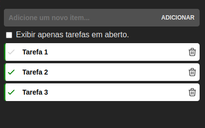
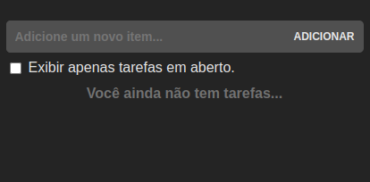

<p align="center">
  

  
  
  <a href="https://github.com/mthenrique/vue3-todo-app/commits/master">
    
  </a>
    
  
  
 
</p>
<h1 align="center">
  

  
</h1>

<h4 align="center"> 
	ToDo App - Vue 3 Composition API 🚀
</h4>

<p align="center">
 <a href="#-sobre-o-projeto">Sobre</a> •
 <a href="#-funcionalidades">Funcionalidades</a> •
 <a href="#-como-executar-o-projeto">Como executar</a> • 
 <a href="#-tecnologias">Tecnologias</a> • 
 <a href="#-autor">Autor</a> • 
 <a href="#user-content--licença">Licença</a>
</p>

## 💻 Sobre o projeto

Uma simples aplicação para criar uma lista de tarefas. A aplicação permite criar, editar, excluir e marcar como concluída cada uma das tarefas da lista.

Projeto desenvolvido com base na documentação do próprio **[Vue.js](https://vuejs.org/guide/introduction.html)**.

---

## ⚙️ Funcionalidades

- [x] Cadastrar tarefas.
- [x] Editar o título de uma tarefa.
- [x] Listar todas as tarefas.
- [x] Listar apenas tarefas não concluídas.
- [x] Excluir tarefas.
- [x] Marcar tarefas como concluída.

---

## 🚀 Como executar o projeto

Este projeto é apenas uma simples aplicação Front-End.

### Pré-requisitos

Antes de começar, você vai precisar ter instalado em sua máquina as seguintes ferramentas:
[Git](https://git-scm.com), [Node.js](https://nodejs.org/en/).
Além disto é bom ter um editor para trabalhar com o código como [VSCode](https://code.visualstudio.com/)

#### 🎲 Rodando o Backend (servidor)

```bash

# Clone este repositório
$ git clone https://github.com/mthenrique/vue3-todo-app.git

# Acesse a pasta do projeto no terminal/cmd
$ cd vue3-todo-app


# Instale as dependências
$ yarn

# Execute o JSON Server que irá simular uma API para o projeto
$ yarn dev:db

# Execute a aplicação em modo de desenvolvimento
$ yarn dev

# O servidor inciará na porta:5000 - acesse http://localhost:5000

```

---

## 🛠 Tecnologias

As seguintes ferramentas foram usadas na construção do projeto:

#### **FrontEnd** ([Vue.js 3](https://nodejs.org/en/) + [TypeScript](https://www.typescriptlang.org/))

- **Vue.js 3**
  - _Composition API_
  - _Script Setup - syntactic sugar_
  - _TypeScript with Composition API_
- **JSON Server**
- **Scss**
- **Vite**

> Veja o arquivo [package.json](https://github.com/mthenrique/vue3-todo-app/blob/master/package.json)

#### [](https://github.com/tgmarinho/Ecoleta#utilit%C3%A1rios)**Utilitários**

- Editor: **[Visual Studio Code](https://code.visualstudio.com/)**
- Markdown: **[StackEdit](https://stackedit.io/)**, **[Markdown Emoji](https://gist.github.com/rxaviers/7360908)**

---

## 🦸 Autor

<a href="https://github.com/mthenrique">
 
 <br />
 <sub><b>Mateus Oliveira</b></sub></a>
 <br />

[](https://www.linkedin.com/in/mthenrique/)

---

## 📝 Licença

Este projeto esta sobe a licença [MIT](./LICENSE).

Desenvolvido por Mateus Oliveira 👋🏽 [Entre em contato!](https://www.linkedin.com/in/mthenrique/)
